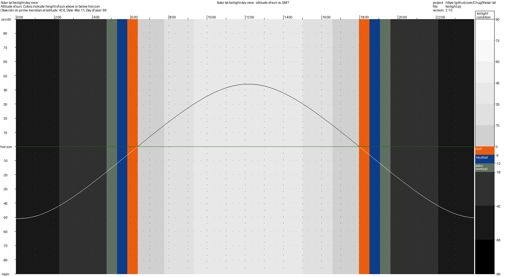
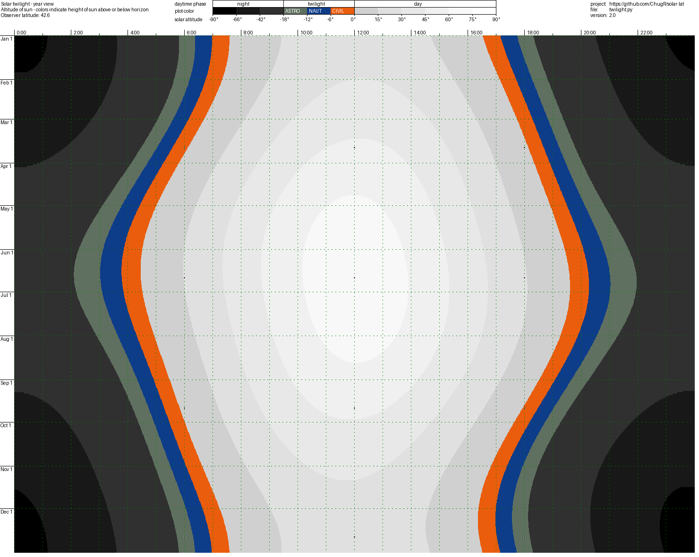
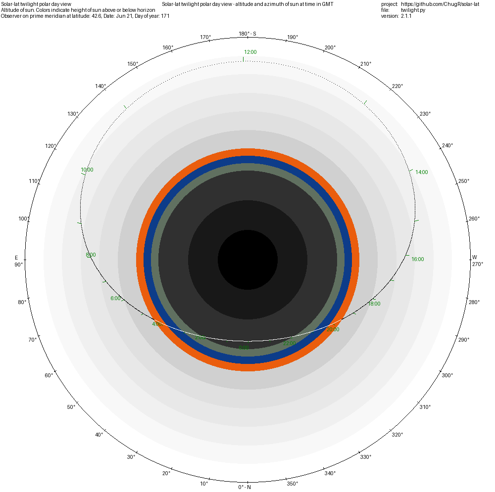

# solar-lat

This project holds results of some recreational twilight studies. My original questions were:

 * Why is early twilight happening at 3:00 a.m.?
 * Which twilight am I seeing: is it civil, nautical, or astronomical twilight?

It instantiates an orbital model of the earth and sun that finds answers my questions and shows why morning and evening twilights are what they are.

Individual files in this project provide these useful functions:

 * File twilight.py generates pictures of day/night/twilight patterns for observers at various latitudes.

 * Several animations that show the generated pictures drawn out for all latitudes or for every day in a year are available as youtube videos. Animation videos are generated by file animations/animation-generator.py.

 * Files research-xxx.py explore twilight patterns programatically.

By far the tropical and arctic/antarctic latitudes have the most interesting twilight patterns.

Enjoy!

# twilight.py Views

## Day view

Day-view images show a plot where the x-axis is the time of day and the y-axis is the elevation of the sun.

Vertical bands highlight when day, night, and twilights change.

A legend describes the plot colors.

### Example day-view

> python twilight.py --day 69



### Day-view animations

These videos select a few observer latitudes and render 365 day-view pictures for each. Then the pictures are sourced to create videos.

#### Day view video at the equator 0.0° latitide

[Video](https://youtu.be/0aChZHzQb2w) showing every day-view for an observer on the equator.

#### Day view video at 42° N latitide

[Video](https://youtu.be/_wDuHEbbcrg) showing every day-view for an observer on 42° N latitide.

## Year view

Year view shows a plot where the x-axis is time of day and the y-axis is the day of the year. The elevation of the sun is implied by the colors of the graph at each point.

A year view is essentially 365 day views where the colors of each day view are one horizontal line in the year view.

### Example year-view

> python twilight.py -o 42.6



### Year-view animation

[Video](https://youtu.be/fvUaUbjAghE) showing every year-view for observers from the south pole (-90°) to the equator (0°) and on to the north pole (+90°).

## Polar day-view

The --polar view is different from year-view and cartesian day-view.
The polar view takes into account that mean time hour angles and solar
position azimuth angles may be wildly different. The polar view is
essentially an azimuth/elevation plot of the sun's position for the day.
Then the plot is marked with its corresponding GMT times shown in green.
    
 * The north, clockwise positive azimuth angle is plotted from the center of the circle with north
   being straight down. This gives a view with noon at the top of the plot,
 
 * The solar elevation is plotted on a linear scale with the nadir (-90°) at the center of the
   circle, the horizon (0°) as the boundary between the twilight color and the
   whitish daylight color, and the zenith (+90°) at the outer edge of the circle.

This view satisfies some of my research goals.

### Example polar day-view

> python twilight.py --date 2019.06.21 --show-day --polar



#### Polar day-view animation at the equator 0° latitide

[Video](https://youtu.be/3UIs0npbElM) showing every polar day-view for an observer on the equator. To me this is the most interesting video.

#### Polar day-view animation at 42° N latitide

[Video](https://youtu.be/3UIs0npbElM) showing every polar day-view for an observer on 42° N latitide.

# Installation

Clone the solar-lat project to a directory of your choice.

Several python modules are required to run it:
```
python -m pip install numpy pandas Pillow
```

# Files

## twilight.py

This is the main program. It has view generators for an observer at some point on the prime meridian. Each view generator creates a picture to be auto-viewed on-screen and/or saved as a .png file.

### twilight.py command line switches

| Switch        | Description                                         |
| ------------- | --------------------------------------------------- |
| --help        | Show help and exit                                  |
| -o O_LAT      | Observer latitude in floating point degrees north   |
| --show-day    | Select day-view instead of default year-view        |
| --polar       | Show polar day-view                                 |
| -d DAY        | In day-view, show this day [0..364]                 |
| --day=DAY     | In day-view, show this day [0..364]                 |
| --date=DATE   | In day-view, show this date. Use format '2019.MM.DD'|
| -f FILE       | Save .png image to FILE in current directory        |
| --no-autoview | Do not autoview the image                           |
| -v --version  | Show program version and exit                       |

#### Notes

* When specifying a day to view in day-view, options -d/--day and --date are mutually exclusive. Specify one or the other but not both.
* This code does not attempt to show leap years. Internally all years are computed with a 2019 calendar and 365 days are displayed.
* This code does not attempt to show daylight savings time. If I was lazy I could always go to https://www.timeanddate.com/sun/usa/boston and see what they say about DST. But what fun is that?
* This code doesn't correct for the sun being a non-zero width disc nor does it correct for atmospheric refraction. The sun is taken as a point source and twilight.py pretends there is no atmosphere on earth.
* Regardless of the year specified by *--date YYYY.MM.DD* this code shows plots for the year 2019 thereby using dates aligned with the programmed ephemeris.
* This code is not organized to help observers in the southern hemisphere. TODO: Add a polar view feature that shows "south counterclockwise positive" azimuth angles.

## SG_sunpos_ultimate_azi_atan2.ph

An advanced solar geometry calculator. This function finds the subsolar point for any time and date using 2019 ephemeris data.

[A solar azimuth formula that renders circumstantial treatment unnecessary without compromising mathematical rigor: Mathematical setup, application and extension of a formula based on the subsolar point and atan2 function - ScienceDirect](https://www.sciencedirect.com/science/article/pii/S0960148121004031)

Algorithms/implementations: Taiping Zhang, Paul W. Stackhouse Jr., Bradley Macpherson, J. Colleen Mikovitz
 
# twilight.py example invocations

## Run a year-view for observer at 42.6° north

> python twilight.py

## Run a year-view for observer at the equator

> python twilight.py --o 0.0

## Run a day-view for observer at 42.6° north on January 5, 2019

> python twilight.py --show-day --date 2024.01.05

## research-twilight-vs-latitude.py

This code explores minutes of day/twilight/night for a year

In 1997 on a trip to Iceland at 66° north latitude one of the guides boasted:
"We have the most twilight of anywhere on earth." Hmmm, I thought. That's quite the claim.
Well, do they?

Spoiler: yes, they do if you count only civil twilight. Folks at 83° north and south
have more astronomical and more total twilight by a small margin. See a chart in
/images/twilight-vs-latitude.pdf for a picture.

Flip side: Who has the least twilight? That honor falls to folks on the equator.
If you've ever been there you might notice that the transition from sunset to
astronomical twilight, total darkness, is only 75 minutes. Be sure to take a
flashlight if you plan to be out in the evening.

Observation: What is up with the odd double peaks in the nautical and astronomical
twilight plots at the polar latitudes?


